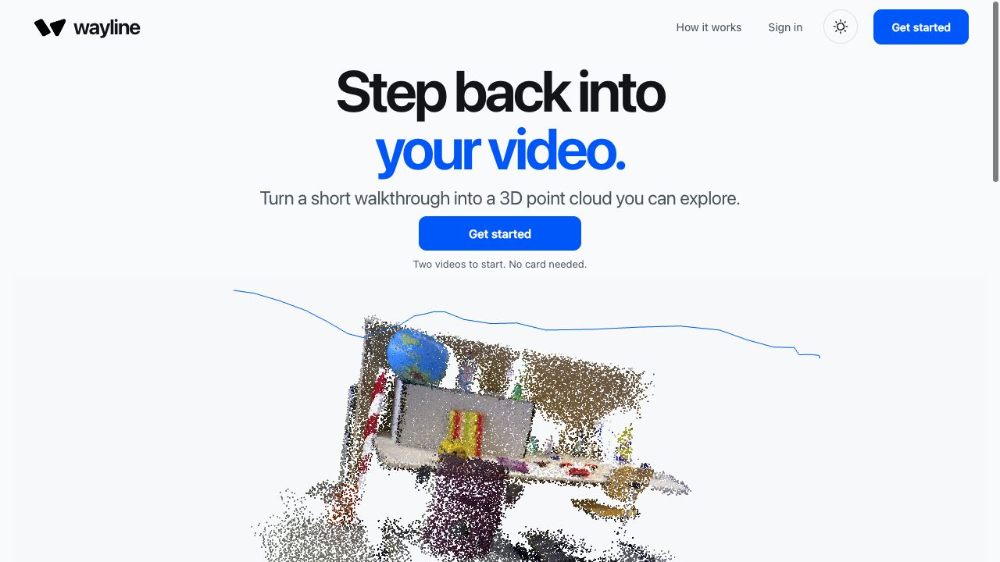
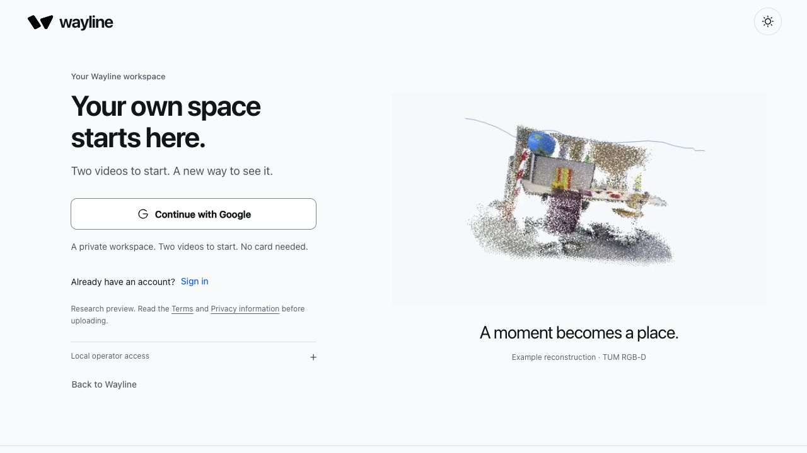
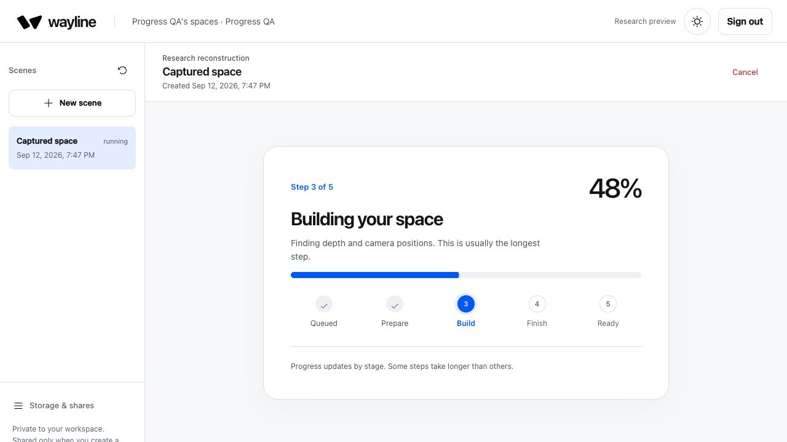
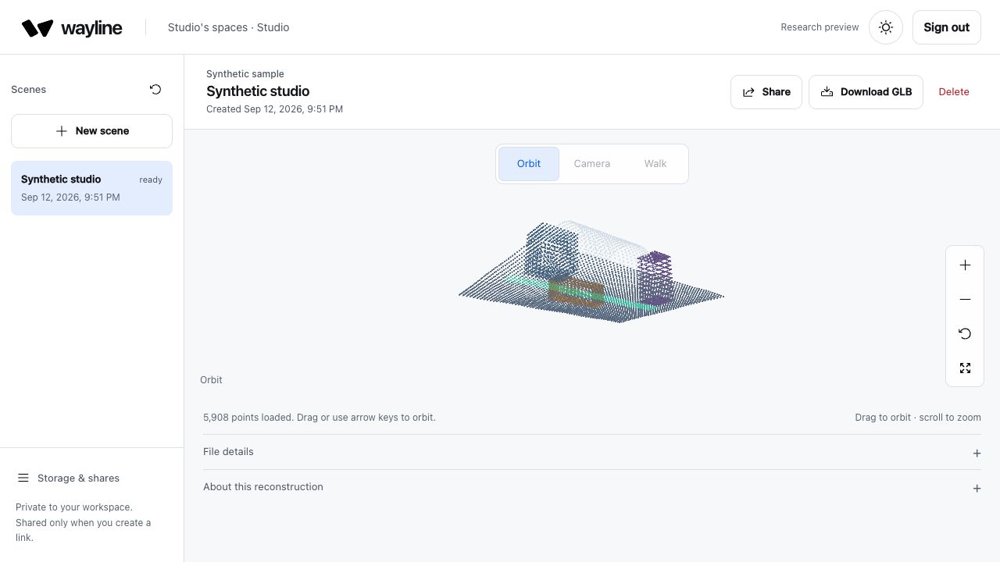
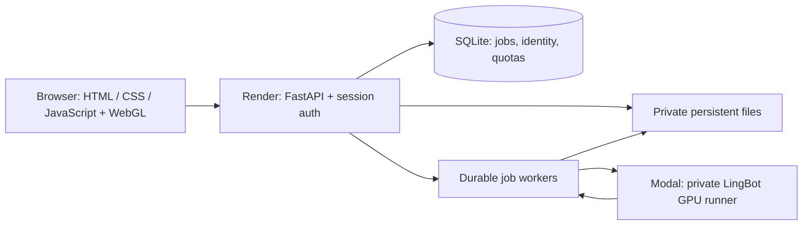

# Wayline

**Turn a short walkthrough into a 3D point-cloud scene you can explore and share.**

[Open Wayline — production URL](https://wayline-9ten.onrender.com/) ·
[Engineer review guide](docs/REVIEWER_GUIDE.md) ·
[Architecture](docs/architecture.md) ·
[Documentation](docs/README.md) ·
[Review PR](https://github.com/ryouol/wayline/pull/10)



Wayline gives a captured space a persistent home: upload a video, follow processing,
then orbit the point cloud, replay the camera path, download a GLB, or create an
expiring view-only share. The frontend and API run together on Render; a private
Modal GPU worker performs reconstruction using the upstream LingBot-Map model.

## Start here

**Live research preview, not general availability.** The deployed application is
functional, but reconstruction quality and hosted model/data rights remain open
review items. A licensed benchmark passed; a later user capture reached READY but
did not pass visual-quality acceptance. See [launch readiness](docs/launch-readiness.md).

The current application and this handoff open by default on
[`codex/production-ready-lingbot-map`](https://github.com/ryouol/wayline/tree/codex/production-ready-lingbot-map).
`main` is the earlier baseline; [PR #10](https://github.com/ryouol/wayline/pull/10)
is draft and unmerged. Review that branch, not `main`, to inspect the deployed product.
The repository remains private; reviewers need access.

## Product flow

1. **Discover:** a visual landing page leads to Google signup.
2. **Create:** upload a short MP4/MOV, then follow preparation, building and saving.
3. **Explore:** orbit, replay camera frames, or use basic walk controls.
4. **Keep or share:** download a GLB or send an expiring, revocable view-only link.

Public accounts receive **two successful lifetime reconstructions**. Failed or
cancelled work does not consume a success; deleting a scene does not reset it.
The verified owner has no personal processing quota. All accounts share the
project's spending, storage, file-size and execution safeguards. Account creation
has no application-wide count cap; this is not unlimited processing capacity.

| Sign up | Processing |
|---|---|
|  |  |



Screenshots show the current UI in isolated local fixtures. The studio scene is
**CC0 synthetic geometry**, not a reconstructed video. Landing/signup artwork is
a precomputed TUM RGB-D office reconstruction. [Screenshot sources](docs/screenshots/README.md).

## Run locally

Prerequisites: Python **3.11**, `uv`, and Node.js to run frontend tests. GPU/CUDA,
Google credentials and Modal billing are unnecessary for the local synthetic flow.

```bash
git clone --branch codex/production-ready-lingbot-map git@github.com:ryouol/wayline.git
cd wayline
uv sync --python 3.11 --frozen --extra dev
uv run wayline --dev
```

Open [localhost:7860](http://127.0.0.1:7860/). Choose **Sign in → Local operator
access**, use the development token printed on first startup, and create a
**Synthetic scene** from **New scene**. Keep that token private. Local state is
stored in `.lingbot-workspace/`; never commit it. Google login requires separate
OAuth configuration. The local operator login is not public onboarding.

## How it is built



| Area | Entry point |
|---|---|
| HTTP, identity and configuration | [workspace/app.py](lingbot_map/workspace/app.py), [auth_routes.py](lingbot_map/workspace/auth_routes.py), [config.py](lingbot_map/workspace/config.py) |
| Job lifecycle and persistence | [service.py](lingbot_map/workspace/service.py), [database.py](lingbot_map/workspace/database.py), [storage.py](lingbot_map/workspace/storage.py) |
| Video, reconstruction and export | [capture.py](lingbot_map/workspace/capture.py), [modal_engine.py](lingbot_map/workspace/modal_engine.py), [modal_app.py](modal_app.py) |
| Product and viewer | [static/](lingbot_map/workspace/static/): `app.js`, `viewer.js`, `timeline.js`, `styles.css` |
| Deployment and checks | [Dockerfile](Dockerfile), [render.yaml](render.yaml), [CI](.github/workflows/ci.yml), [tests/](tests/) |
| Original model research | [lingbot_map/](lingbot_map/), [demo.py](demo.py), [benchmark/](benchmark/) |

One Render Starter instance and a persistent disk serve the app. SQLite and the
disk prevent horizontal scaling; deploys can briefly interrupt availability.
Opening an existing scene uses browser WebGL and does not rerun the GPU model.
The viewer supports the exported colored **POINTS** contract, not arbitrary GLB meshes.

## Verify and deploy

```bash
uv run pytest
uv run ruff check .
uv run mypy lingbot_map/workspace lingbot_map/checkpoints.py
for suite in tests/*.test.js; do node "$suite" || exit 1; done
docker build -t wayline:local .
uv run python scripts/smoke_container.py --image wayline:local
```

[CI](.github/workflows/ci.yml) additionally checks strict lint/format rules,
dependency locks, wheel contents and the constrained production container.
Install `age` and `age-keygen` to run the encryption/restore tests locally;
without them, those tests may skip. CI installs the encryption tools.
The deployed runtime at `785bc7e` passed **273 Python tests and 11 Node suites**.
Tests using mocked providers are not live GPU or OAuth acceptance evidence.

Use the [Render + Modal runbook](docs/deployment.md) for deployment, secrets,
backups and recovery. Deploys are manual, using an exact reviewed commit.
[Operating costs](docs/operating-costs.md) documents the approximately $20/month
target and the distinction between application allowances and a provider invoice cap.

## Naming and rights

**Wayline** is the application and repository name. `lingbot_map`, the installed
`lingbot-map` Python distribution, existing configuration keys and the historical
branch name remain stable integration identifiers. They retain the model's origin
and avoid breaking deployments, imports or stored workspaces during a docs cleanup.

[LICENSE.txt](LICENSE.txt) covers repository source only as stated there.
[MODEL_PROVENANCE.md](MODEL_PROVENANCE.md) tracks unresolved model/checkpoint/data
rights. [THIRD_PARTY_NOTICES.md](THIRD_PARTY_NOTICES.md) retains upstream notices;
[SAMPLE_LICENSE.md](SAMPLE_LICENSE.md) separately dedicates the synthetic sample
to CC0. The product rename is not an endorsement or a claim of commercial clearance.
