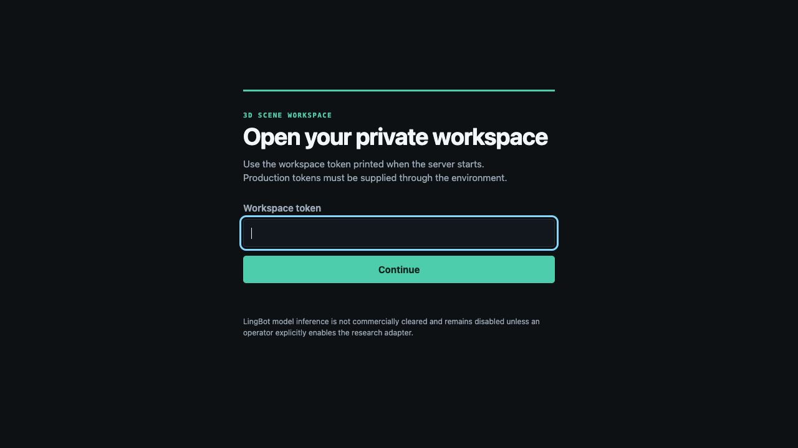
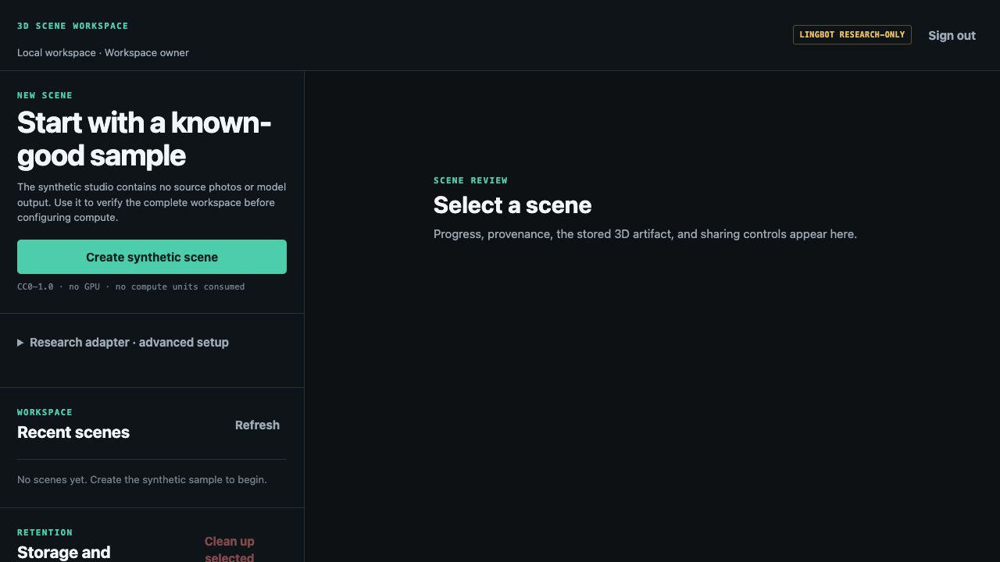
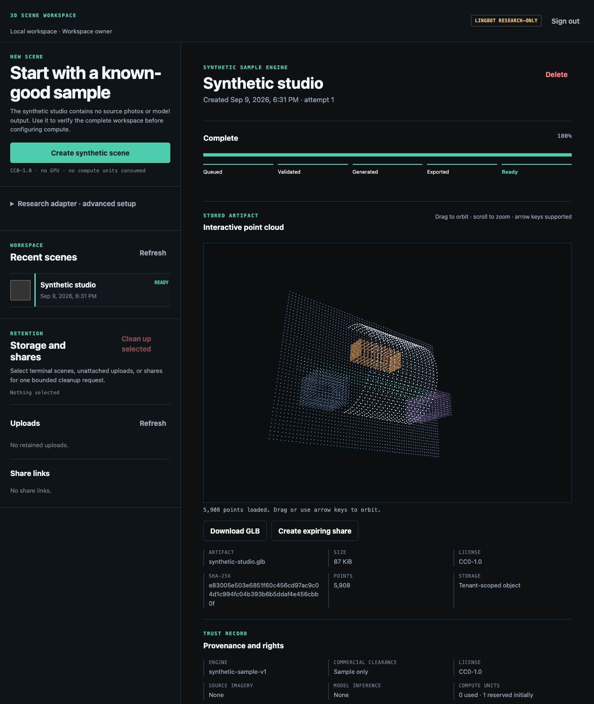
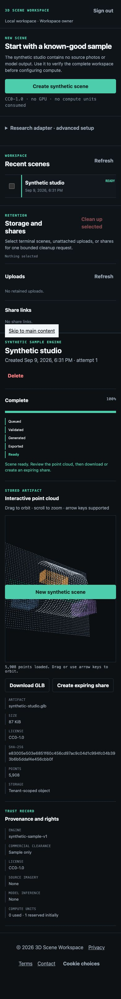
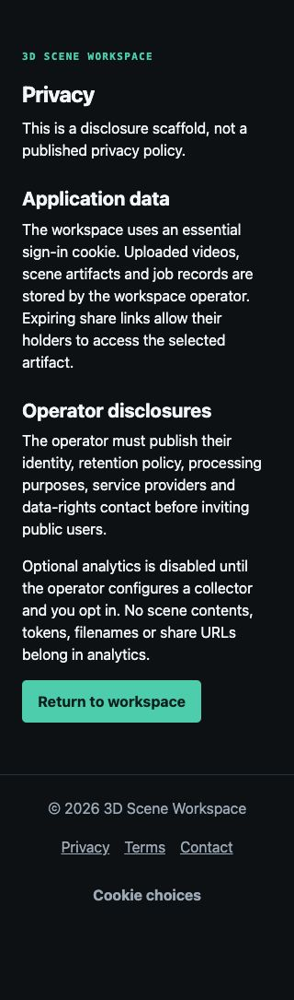
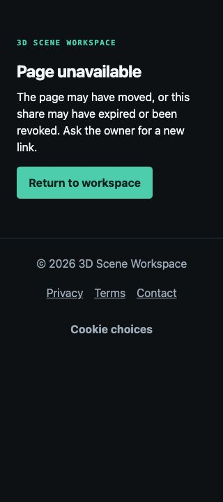

# Production-hardening and UX audit — LingBot Map

Date: 2026-09-09. Scope: the supported **3D Scene Workspace**, not certification of the upstream research model.

## Outcome and release gate

The authenticated local synthetic-scene workflow works and the application envelope is hardened. **Public sale/release is not approved**: operator legal/contact information, final domain, deployment controls and research commercial clearance remain unresolved. The analytics adapter is deliberately **disabled scaffolding, not a live analytics integration**. No cloud settings, payments, credentials, or Git remotes were changed.

Stack: FastAPI/Python ASGI backend; plain JavaScript and existing dark/aqua CSS; SQLite and a private filesystem object store. Supported hosting is one Linux instance behind a TLS reverse proxy with a persistent encrypted volume, per `docs/deployment.md`. There is no configured Supabase, Firebase, Postgres database or S3 bucket to audit remotely.

Status: ✅ implemented/verified locally; ⚠️ needs operator input or verification; ➖ not applicable, with justification. Every requested item is accounted for below; an ⚠️ is not a completed release gate.

Path notation below: `workspace/` abbreviates `lingbot_map/workspace/`; `static/` abbreviates `lingbot_map/workspace/static/`.

## Phase 1 — Security

### Findings fixed

1. **SEC-01 / FASTAPI-AUTH-002 — Medium, capability URL logging.** The exception logger previously interpolated `request.url.path`, which can contain a share capability. `lingbot_map/workspace/app.py:427` now logs a constant message. A regression induces a failure under a token-shaped path and asserts that the path is absent from logs. Reverse-proxy/APM path redaction is still an operator obligation.
2. **SEC-02 / FASTAPI-RESP-001 — Low, validation input echo.** FastAPI's default validation response can echo a malformed workspace token. `app.py:506` now returns only `loc`, `msg`, `type`, never `input` or validation context. The regression verifies a malformed token is absent from the response.
3. **SEC-03 / FASTAPI-CSRF-001 — Defense in depth, stale-CSRF logout.** `app.py:479` retains the existing intentional stale-CSRF sign-out recovery, but rejects an off-origin Origin or `Sec-Fetch-Site: cross-site`. All other cookie-authenticated writes require the stored session CSRF token. Logout still requires an authenticated session; this is not an anonymous bypass.
4. **SEC-04 — Low, cache/index surface.** Share HTML now receives `Cache-Control: no-store`; all responses receive `X-Robots-Tag: noindex, nofollow, noarchive`. Crawling is not authentication; token expiry/revocation and ownership remain the access controls.

### Secret and bypass review

✅ Searched repository source/client files for private-key headers, AWS/GitHub/live-payment token signatures, credential assignments, permissive auth flags, unconditional gates, `verify_signature=False`, `shell=True`, and public-read/public-write storage settings. No live embedded credential matched the reviewed patterns. No key was moved because no exposed live key was found. This is a working-tree scan, not exhaustive Git-history/provider-secret detection or credential rotation.

| Credential/category found | Location and disposition |
|---|---|
| `LINGBOT_BOOTSTRAP_TOKEN` | Already read exclusively from server environment in `workspace/config.py`; explicit development generates a random token. Production requires a supplied token of at least 32 characters. Never bundled into browser scripts. |
| API/session/CSRF/share tokens | Generated runtime values; token digests and tenant/session records live server-side in SQLite. Session cookie is HttpOnly, SameSite=Strict, Secure in production. CSRF exists in runtime JS memory, not persistent browser storage. Share tokens are intentionally time-limited bearer capabilities. |
| `BOOTSTRAP_TOKEN` and other test token fixtures | Explicit fake values in `tests/`; retained as non-production fixtures, never a production default. |
| Model `token`/`tokens` identifiers | Tensor/model vocabulary, not credentials. No relocation needed. |
| Research enablement | Explicit rights acknowledgement, pinned checkpoint digest and isolated runner prerequisites; retained as product safety/licensing gates, not removed as a bypass. |

### Every endpoint and protection

`P` below means `CurrentPrincipal`: bearer token or server session; tenant identity from authenticated state, never from caller JSON. `C` means cookie writes also require CSRF. Typed IDs enforce resource prefix + 32 hex characters. Service/database methods apply ownership, transition, retention, quota and idempotency rules. All API responses are no-store.

| Method | Endpoint | Protection and validation |
|---|---|---|
| GET | `/healthz` | Intentionally public minimal readiness status only; no tenant/configuration details. |
| POST | `/api/session` | Intentionally pre-session: possession of valid API token authenticates. Strict body model, token length 16–512, whitespace normalization, unknown fields rejected, bounded per-IP limiter. HttpOnly/Strict cookie issued. |
| GET | `/api/me` | P; current user/session/tenant quota only. |
| DELETE | `/api/session` | P; revokes only current session. Same-origin/Fetch Metadata check for browser logout; stale CSRF exception explained above. No caller-selected session ID. |
| GET | `/api/engines` | P; approved descriptor response model, no model secrets. |
| POST | `/api/assets` | P+C; multipart file, byte/content/video limits, safe generated object key, tenant storage/rate limits; bounded idempotency key. |
| GET | `/api/assets` | P; tenant inventory; limit 1–100, cursor ≤512 and parsed/validated. |
| DELETE | `/api/assets/{asset_id}` | P+C; typed asset ID, tenant ownership, attachment/retention transition rules, bounded idempotency key. |
| POST | `/api/jobs/sample` | P+C; server-owned synthetic specification, bounded quota/rate/idempotency controls; no arbitrary body fields are consumed. |
| POST | `/api/jobs/research` | P+C; strict research model, owned typed asset, frame/FPS ranges, literal mode; licensing/checkpoint/runner gate. |
| GET | `/api/jobs` | P; tenant inventory; bounded and validated limit/cursor. |
| GET | `/api/jobs/{job_id}` | P; typed job ID and tenant-owned record with approved response shape. |
| POST | `/api/jobs/{job_id}/cancel` | P+C; typed job, tenant ownership, state transition and idempotency. |
| DELETE | `/api/jobs/{job_id}` | P+C; typed job, tenant ownership, terminal-state deletion rules and durable outbox. |
| GET | `/api/artifacts/{artifact_id}/content` | P; typed ID, published artifact ownership, server-owned object path; no caller filesystem path. |
| GET | `/api/artifacts/{artifact_id}/download` | P; same owned artifact check; attachment filename from generated artifact metadata. |
| POST | `/api/artifacts/{artifact_id}/shares` | P+C; typed artifact ownership, strict TTL 300–604800 seconds, share quota/rate/idempotency. |
| GET | `/api/shares` | P; tenant inventory; bounded and validated limit/cursor. |
| DELETE | `/api/shares/{share_id}` | P+C; typed share ID, tenant ownership, revocation/idempotency. |
| POST | `/api/bulk-delete` | P+C; strict body, 1–100 total IDs with exact shape validation, per-object tenant checks and errors. |
| GET | `/api/public/shares/{token}` | Intentionally capability-authenticated: token shape/length, hashed lookup, expiry and revocation; constrained artifact metadata only. No account cookie required. |
| GET | `/api/public/shares/{token}/content` | Same capability validation; only its selected artifact, no path input. |
| GET | `/s/{token}` | Same valid, unexpired capability required; generic share HTML metadata avoids tenant/filename disclosure to crawlers. |
| GET | `/` | Public sign-in shell, no private records embedded. |
| GET | `/privacy` | Public operator disclosure scaffold; no customer data. |
| GET | `/terms` | Public operator terms scaffold; no customer data. |
| GET | `/contact` | Public contact scaffold; missing data is explicit, no invented contact details. |
| GET | `/robots.txt` | Public constant disallow-all crawl policy. |
| GET | `/sitemap.xml` | Public generated empty URL set: no private jobs or shares enumerated. |
| GET/HEAD | `/static/{path}` | Public packaged UI assets only, constrained by StaticFiles directory; uploads/data directory is not mounted. |
| GET | `/docs`, `/docs/oauth2-redirect`, `/openapi.json` | Development/test only. Disabled in production; no `/redoc` route. |

✅ All 18 private operations have parameterized anonymous-rejection regression tests. Existing tests cover tenant isolation, artifact/share access, revocation/expiry, CSRF, upload bounds, idempotency, quotas and production configuration. No serverless/alternate HTTP route declarations were found outside this supported app.

### Database and storage

➖ Database RLS/security-rule switch: SQLite has no Supabase/Postgres/Firebase RLS facility and there is no browser database client. All tables (`schema_meta`, `tenants`, `users`, `api_tokens`, `sessions`, `assets`, `jobs`, `artifacts`, `shares`, `usage_ledger`, `deletion_outbox`, `object_claims`, `idempotency_keys`, `rate_buckets`) are accessed only by the server process. No table has anonymous direct network access. Tenant-owned object operations are tested at the application/database boundary. System tables are internal only. A future Postgres migration must design and test its own database roles/RLS; current checks do not certify that future system.

✅ Local storage is private: `database.py:85–99` applies directory 0700 and DB/WAL/SHM 0600; `storage.py:53–100` confines normalized keys to its private root and atomically writes 0600 files. There is no public upload mount. Share access is scoped, expiring and revocable.

➖ Public cloud-bucket ACL changes: no configured cloud object bucket. ⚠️ Live volume encryption, backups/restores, reverse-proxy body limits including chunked requests, distributed abuse limits, forwarded-header trust and upstream logging must be verified by the operator before release. No infrastructure account was accessed.

Phase 1 changed: `workspace/app.py`, `tests/test_production_ux.py`. Deliberately retained: established same-site stale-CSRF logout recovery and the research licensing gate. No auth checks were disabled.

## Phase 2 — Production envelope

| Requested item | Status and implementation/justification |
|---|---|
| Custom 404 and 500 | ✅ HTML recovery screens for browser requests; API errors remain JSON with status/security headers and no traceback. 500 is integration-tested using an induced internal exception, not an exposed error-test endpoint. |
| Above-fold CTA | ✅ Sign-in has one large Continue action; workspace starts with Create synthetic scene. Support/error pages offer Return to workspace. |
| Per-page title | ✅ Home, shared scene, privacy, terms, contact and error views have distinct titles. |
| Per-page description | ✅ Same routes receive explicit descriptions through `pages.py`. |
| OG/Twitter and default image | ✅ Generic privacy-safe tags and checked-in 1200×630 fallback image. ⚠️ Set `LINGBOT_PUBLIC_BASE_URL` to the approved deployment origin for absolute URLs. No private artifact preview is exposed to crawlers. |
| Complete favicon set | ✅ ICO, 16/32 PNG, Apple touch icon, 192/512 icons and manifest. ISC-licensed Lucide Boxes source and license are included; rasterization script fails on a blank render. |
| robots.txt | ✅ Disallow all: this is a private workspace, not a marketing site. |
| Generated sitemap.xml | ✅ Valid generated empty URL set intentionally excludes every private/non-indexable route. No fake domain, tenant URLs or bearer share links. |
| Alt text on every image | ✅ Social image alt is descriptive. ➖ There are no rendered `` elements; native canvas has an accessible label, keyboard controls and text status. |
| Analytics | ⚠️ Consent-aware, same-origin adapter scaffold in `static/site.js`; ID and endpoint empty, zero collection by default. It is **not live**. Owner must supply/audit a collector and its contract and update policy/consent version before enabling it. |
| Privacy | ⚠️ Real route with code-grounded data disclosure plus explicit draft/owner TODO; not represented as approved legal policy. |
| Terms | ⚠️ Real route labels missing approved terms and preserves research restrictions; not a made-up contract. |
| Cookie banner / EU consent | ✅ Essential-only and opt-in choices, persistent preference, reopen/withdraw control; analytics fails closed if storage is unavailable. Legal adequacy remains owner/legal review. |
| Thank-you page after submits | ➖ No lead/signup/contact form exists. Login enters the workspace with confirmation; upload queues a scene with progress/next steps; sharing uses the existing confirmation dialog. A separate thank-you route would interrupt these app workflows. |
| Email / phone / address | ⚠️ `/contact` scaffolds all three explicitly. No fake mailto/tel links or address were introduced. Owner must supply actual data or confirm phone support is not offered. |

Phase 2 changed: `workspace/pages.py`, `workspace/app.py`, `static/index.html`, `static/share.html`, `static/site.js`, `static/site.webmanifest`, `static/icon.svg`, `static/ICON-LICENSE.txt`, `static/{favicon.ico,favicon-16.png,favicon-32.png,apple-touch-icon.png,icon-192.png,icon-512.png,social-preview.png}`, `scripts/build_brand_assets.py`, `tests/test_production_ux.py`.

Deliberately skipped: invented legal/contact data, third-party tracking requests, search indexing of private data, and an unnecessary marketing form/thank-you flow. Fresh browser testing exposed stale asset reuse, so rendered HTML now fingerprints local asset URLs by content; a release cannot silently mix old CSS/JS with new markup.

## Phase 3 — Forms, states and dead ends

| Requested item | Status and implementation/justification |
|---|---|
| Every async action / route loading | ✅ Central API busy status and bounded request timeout; visible sign-in/sample/upload stages; existing progress and viewer loading; native document navigation for support routes. All private actions use the shared API path. No claim that every deployed operation completes within 400ms. |
| Form errors / inline validation | ✅ Native required/range/type checks plus authoritative Pydantic/service validation. Login associates its inline error and invalid state with the input; API validation arrays become readable messages. |
| Success/error submissions | ✅ Login, sample/research submission, cancellation status, deletion/revocation and share dialog communicate outcome; ready scenes have explicit review/download/share next steps. Clipboard failure selects the URL with a manual-copy explanation. |
| Broken buttons / handlers | ✅ Scene-selection promise rejection is caught; download links are absent/hidden until a valid artifact is available. Disabled research/cleanup actions are intentional with reasons. Existing API regressions cover underlying destructive actions without deleting real user data during browser QA. |
| Internal / external / footer links | ✅ Privacy/Terms/Contact routes and return links were opened; local asset/metadata links are tested. No external runtime links are present in the workspace UI. Expiring artifact/share links are expected to fail after revoke/expiry, with recovery guidance. |
| Clickable logo | ✅ Product wordmark links home on app, share and support/error pages. |
| Placeholders / unused navigation | ✅ Hidden dynamic-state labels retained intentionally; nonfunctional `href="#"` download placeholders removed. Research options are collapsed, not removed or falsely enabled. Owner TODO scaffolds remain visibly pending. |
| Dynamic copyright | ✅ Footer uses the current year at runtime. |

Phase 3 changed: `static/app.js`, `static/share.js`, `static/index.html`, `static/share.html`, `static/site.js`, `pages.py`. Deliberate limits: no real external mail/checkout/form submission was fabricated; no unsupported research inference was enabled. Repeated unchanged polling no longer rebuilds the scene list, reducing keyboard-focus loss. Scene selection focuses its detail heading; mobile selection scrolls to the actual result. Failed viewer loads can retry rather than being permanently marked loaded.

## Phase 4 — Mobile and performance

| Requested item | Status and implementation/justification |
|---|---|
| No horizontal overflow | ✅ Workspace measured 390/390 and 320/320 viewport/document width; privacy, terms and contact measured 320/320. Long hashes wrap and inventory controls reflow. These are sampled fixtures, not proof for arbitrary future content. |
| Real breakpoints across pages | ✅ Existing 860/560 breakpoints retained; support shells are fluid; mobile text/control spacing improved. |
| Hamburger / focus-trapped mobile menu | ➖ No navigation drawer or hidden menu exists. Three public footer links remain visible and wrap; introducing an unnecessary hamburger would add interaction cost. Existing share modal is a native `<dialog>`. |
| Sticky primary mobile CTA | ✅ Authenticated mobile viewport has a sticky jump back to scene creation. It does not silently create duplicate jobs and disappears when signed out. |
| Images compressed / modern / srcset / lazy | ✅ Small optimized local icon PNGs and social fallback generated once. ➖ No responsive photo/content image gallery exists, so srcset/lazy-loading would not apply; point-cloud assets load only for selected scenes. No new animation/3D framework dependency was introduced. |
| Tap targets ≥44px / readable type | ✅ Primary/secondary/text actions, footer links and checkbox label hit areas meet 44px minimum; checkbox glyph stays 18px. Mobile body is 16px and explanatory text 14px. Existing focus-visible and reduced-motion rules retained. |

Phase 4 changed: `static/styles.css`, `static/app.js`, `static/index.html`, brand assets. Deliberately skipped: a fabricated mobile drawer, decorative imagery and new WebGL packages. Screen-reader, physical iOS/Android and complete contrast certification remain follow-up checks.

## Phase 5 — UX laws applied

| Law | Status and concrete implementation |
|---|---|
| Hick / Occam / Tesler | ✅ Defer unavailable/advanced research controls behind a native disclosure; keep synthetic creation first. Preserve server-owned quota/rights complexity rather than making users configure it on entry. |
| Fitts / target distance | ✅ 44px controls and enlarged checkbox label targets; mobile result selection scrolls directly to detail; sticky route back to creation. |
| Jakob / Similarity / Uniform Connectedness | ✅ Conventional home wordmark, labeled forms, native disclosure/dialog and grouped action styles reused. |
| Proximity / Prägnanz | ✅ Related research settings remain inside one disclosure; inventory actions stay with their record at mobile widths; no decorative interface introduced. |
| Miller | ✅ Three footer links and one settings action, five visible processing stages; existing pagination remains 25 scenes per page instead of loading unbounded inventory. |
| Doherty | ✅ Immediate busy/button state, queue/progress feedback and cached unchanged list rendering. Backend latency is not misrepresented as <400ms. |
| Von Restorff | ✅ Existing aqua primary creation action remains the strongest action; destructive/secondary actions stay subordinate. |
| Serial Position | ✅ Scene creation stays first, recent scenes follow, retention controls later, contact remains at the end of public links. |
| Peak-End / Zeigarnik | ✅ Explicit upload→queue messages, persistent five-stage progress, ready-state next step and clipboard confirmation/recovery. |
| Postel | ✅ Trim accidental token whitespace at browser and server; preserve strict length/type/unknown-field validation and stored canonical token semantics. |
| Pareto | ✅ Prioritized login→synthetic scene→review/download/share and failure recovery, not speculative new product workflows. |

Phase 5 changed: primarily the Phase 3/4 files. These are implemented constraints, not a claim of usability-study results.

## Phase 6 — Optional visual polish proposal (not executed)

➖ Optional refresh: propose **restrained technical workbench** — retain the charcoal/aqua palette and utilitarian typography, reduce nonessential status noise, and organize scene detail around review then export. Await owner choice before any broader refresh.

➖ Magic UI: React-specific dependency does not match plain JavaScript; not installed. ➖ Threlte/R3F: neither Svelte nor React is present; existing small point-cloud renderer already serves the core task. ➖ Vectary/Jitter: no authored export was supplied; an approved lightweight exported demo could later sit outside the authenticated workspace. Neither is a code dependency to install.

## Current-run visual evidence

Fresh Codex in-app browser captures, using a disposable local test workspace with the repository's fake test credential. No real user uploads or production records were touched. Accepted images were inspected; captures do not certify WCAG compliance or model reconstruction quality.

1. **Entry before changes — usable but operator-oriented.** `ux-evidence/01-login-before.png`: clear single CTA; no legal/contact navigation and developer-facing token language. Addressed by revised invitation guidance and support footer.
2. **Workspace — healthy synthetic entry.** `ux-evidence/02-workspace.png`: one primary creation action, advanced research collapsed, clear empty-state next step.
3. **Scene ready — healthy local end-to-end.** `ux-evidence/03-scene-ready.png`: synthetic job completed, 5,908-point stored artifact rendered, download/share controls and provenance visible. This is not real-world model output.
4. **Mobile workspace — verified reflow.** `ux-evidence/04-mobile-workspace.png`: 390px layout, wrapping facts, sticky creation navigation and explicit completion. Desktop/native keyboard and 320px widths were also checked. The full-page image composites the viewport-fixed CTA at its capture position.
5. **Privacy — intentionally needs input.** `ux-evidence/05-privacy-draft.png`: readable 320px disclosure, honest missing operator policy. Owner must replace the scaffold before release.
6. **Missing page — healthy recovery.** `ux-evidence/06-not-found.png`: custom 404 and working route home; no internal error data.

## Verification

- `.venv/bin/pytest -q`: **99 passed** (70 existing + 29 new parameterized cases).
- `.venv/bin/ruff check lingbot_map/workspace tests scripts/build_brand_assets.py`: passed.
- `.venv/bin/mypy lingbot_map/workspace`: passed, 9 source modules.
- `node --check` for changed app/site scripts: passed.
- `node --test tests/session-events.test.js`: passed.
- `git diff --check`: passed.
- Browser: sign-in with surrounding whitespace, essential-only consent, synthetic creation, rendered artifact, mobile scene selection, footer route traversal, and 404 recovery checked. Viewport override reset after capture.
- Icons regenerated with Cairo/Pillow from the licensed SVG and inspected; initial blank ImageMagick render was rejected and replaced, not accepted as completion.

Limits: no paid/research engine run, GPU job, physical mobile device, deployed proxy/CDN, cloud IAM, provider secrets/Git history, backup restore or legal review was performed. Full WCAG and performance/load certification are not claimed.

## Owner TODO markers and remaining actions

1. `workspace/pages.py` privacy HTML comment: approved privacy policy, controller, lawful bases, subprocessors, actual retention periods, rights process and privacy contact.
2. `workspace/pages.py` terms HTML comment: approved terms, legal entity, jurisdiction, billing/refund, acceptable-use and liability rules.
3. `workspace/pages.py` contact HTML comments: real support email→mailto, real phone→tel or confirm no phone support, legal entity/physical address.
4. `workspace/pages.py` analytics HTML comment and `static/site.js:4`: approved measurement ID and an audited same-origin collector endpoint with the documented payload contract. **Do not just fill an ID and assume analytics works**: the collector must exist, collection must be tested, policy updated and consent version reviewed. No collector or third-party integration is currently live.
5. `static/index.html:8`: approved `LINGBOT_PUBLIC_BASE_URL` for deployment/social metadata.

Then validate the deployment runbook controls and research licensing clearance before public release. Optional refresh remains a proposal; no push/merge was performed.
